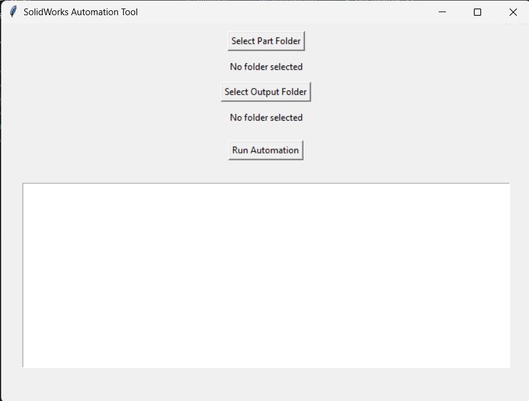
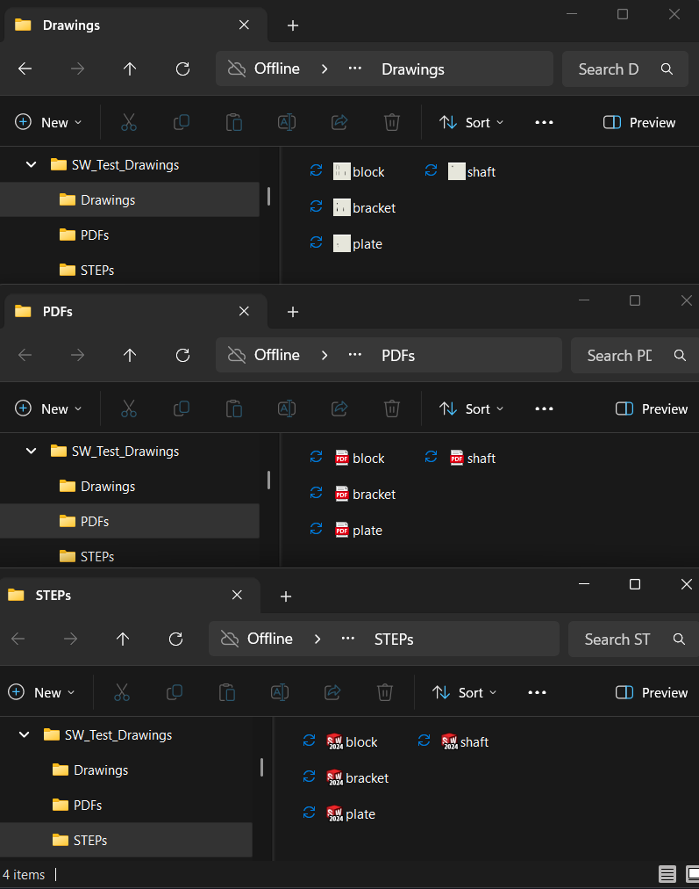

# SolidWorks Automation Tool

## Overview

A Python-based automation tool designed to streamline repetitive SolidWorks documentation workflows. The program automates the processing of part files, generation of engineering drawings, export of manufacturing files, and organization of project outputs.

The goal of this project was to reduce manual CAD documentation steps by integrating Python automation with the SolidWorks API.

## Features

- Batch processes SolidWorks part files from a selected folder
- Automatically generates SolidWorks drawing documents
- Exports PDF drawings and STEP models
- Extracts and updates part metadata
- Creates organized output folders for generated files
- Provides a graphical user interface for user-controlled automation
- Provides processing summaries and error reporting

## Technologies Used

- Python
- SolidWorks API
- COM automation through pywin32
- Tkinter GUI framework
- SolidWorks 2024

## Workflow

1. User selects a folder containing SolidWorks part files
2. The program opens and processes each part automatically
3. Part information is extracted and updated
4. Engineering drawings are generated
5. Drawings are exported as PDFs
6. Parts are exported as STEP files
7. Outputs are organized into designated folders

## Screenshots

### User Interface

### Generated Drawing

### Output Organization

## Future Improvements

Potential improvements include:
- Additional drawing dimension automation
- Support for assemblies
- Enhanced user interface features

